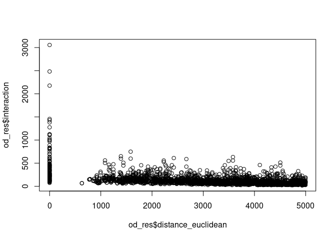
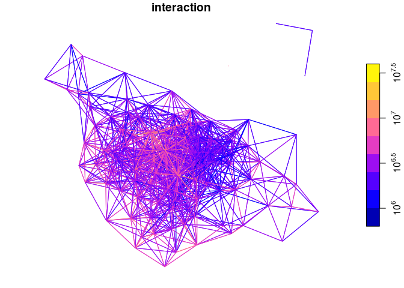

<!-- badges: start -->

[](https://github.com/robinlovelace/simodels/actions)
[](https://github.com/Robinlovelace/simodels/actions/workflows/R-CMD-check.yaml)
<!-- badges: end -->

The goal of {simodels} is to provide a simple,
[tidy](https://www.tidyverse.org/), and flexible framework for
developing spatial interaction models (SIMs). SIMs estimate the amount
of movement between spatial entities and can be used for many things,
including to support evidence-based investment in sustainable transport
infrastructure and prioritisation of location options for public
services.

Unlike many software tools designed to support spatial interaction
modelling, {simodels} does not define (or even encourage use of) any
particular functional forms or modelling frameworks for predicting
movement between origins and destinations. Instead, it provides a
framework enabling you to use model function forms or models of your
choosing, ensuring flexibility and encouraging flexibility.

## Installation

Install the package as follows:

``` r
install.packages("remotes") # if not already installed
```

``` r
remotes::install_github("robinlovelace/simodels")
```

To get the develoment version do:

``` r
devtools::load_all()
```

<!-- # Implementations in other languages -->

## simodel basics

Run a basic SIM as follows:

``` r
library(simodels)
library(dplyr)
# prepare OD data
od = si_to_od(
  origins = si_zones,        # origin locations
  destinations = si_zones,   # destination locations
  max_dist = 5000            # maximum distance between OD pairs
  )
# specify a function
gravity_model = function(beta, d, m, n) {
  m * n * exp(-beta * d / 1000)
} 
# perform SIM
od_res = si_calculate(
  od,
  fun = gravity_model,
  d = distance_euclidean,
  m = origin_all,
  n = destination_all,
  constraint_production = origin_all,
  beta = 0.9
  )
# visualize the results
plot(od_res$distance_euclidean, od_res$interaction)
```



What just happened? We created an ‘OD data frame’ with the function
`si_to_od()` from geographic origins and destinations, and then
estimated a simple ‘production constrained’ (with the
`constraint_production` argument) gravity model based on the population
in origin and destination zones and a custom distance decay function
with `si_calculate()`. As the example above shows, the package
allows/encourages you to define and use your own functions to estimate
the amount of interaction/movement between places.

The approach is also ‘tidy’, allowing use of {simodels} functions in
{dplyr} pipelines:

``` r
od_res = od %>% 
  si_calculate(fun = gravity_model, 
               m = origin_all,
               n = destination_all,
               d = distance_euclidean,
               constraint_production = origin_all,
               beta = 0.3)
od_res %>% 
  select(interaction)
```

    Simple feature collection with 2505 features and 1 field
    Geometry type: LINESTRING
    Dimension:     XY
    Bounding box:  xmin: -1.743949 ymin: 53.71552 xmax: -1.337493 ymax: 53.92906
    Geodetic CRS:  WGS 84
    # A tibble: 2,505 × 2
       interaction                                 geometry
             <dbl>                         <LINESTRING [°]>
     1       2177. (-1.400108 53.92906, -1.400108 53.92906)
     2        632. (-1.400108 53.92906, -1.346497 53.92305)
     3        556. (-1.346497 53.92305, -1.400108 53.92906)
     4       1382. (-1.346497 53.92305, -1.346497 53.92305)
     5        449. (-1.346497 53.92305, -1.357667 53.88306)
     6        794. (-1.704658 53.91073, -1.704658 53.91073)
     7        749.   (-1.704658 53.91073, -1.6876 53.90066)
     8        287. (-1.704658 53.91073, -1.743949 53.88035)
     9        267. (-1.704658 53.91073, -1.710657 53.87087)
    10        186. (-1.704658 53.91073, -1.694076 53.86729)
    # ℹ 2,495 more rows

The resulting estimates of interaction, returned in the column
`interaction` and plotted with distance in the graphic above, resulted
from our choice of spatial interaction model inputs, allowing a wide
range of alternative approaches to be implemented. This flexibility is a
key aspect of the package, enabling small and easily modified functions
to be implemented and tested.

The output of `si_calculate()` is a geographic object that can be
plotted with `sf`’s plot method (or other geographic data visualisation
packages):

``` r
plot(od_res["interaction"], logz = TRUE)
```



The `si_to_od()` function transforms geographic entities (typically
polygons and points) into a data frame representing the full combination
of origin-destination pairs that are less than `max_dist` meters apart.
A common saying in data science is that 80% of the effort goes into the
pre-processing stage. This is equally true for spatial interaction
modelling as it is for other types of data intensive analysis/modelling
work. So what does this function return?

The function allows you to use any variable in the origin or destination
data by joining all attributes onto the OD data frame, with column names
appended with `origin` and `destination`.

The approach works equally well for ‘bipartite’ SIMs, in which origin
and destination points are different (Hasova et
al. [2022](https://lenkahas.com/files/preprint.pdf)). The following
example implements a bipartite SIM that estimates the number of trips
from administrative zones to pubs in Leeds:

``` r
# Set n. trips to pubs, assuming that for every trip to the pub there are
# 50 trips to work (this would be validated/tested/modelled in empirical work)
zones_pubs = si_zones %>% 
  mutate(to_pubs = all / 50)
pubs_example = si_pubs %>% 
  filter(grepl(pattern = "Chemic|Nag", x = name))
pubs_example$size = c(100, 80)
od_to_pubs = si_to_od(zones_pubs, pubs_example)
od_to_pubs_result = od_to_pubs %>% 
  si_calculate(fun = gravity_model, 
               m = origin_to_pubs,
               n = destination_size,
               d = distance_euclidean,
               beta = 0.5,
               constraint_production = origin_to_pubs)
od_to_pubs_result %>% 
  select(O, D, destination_name, interaction)
```

    Simple feature collection with 214 features and 4 fields
    Geometry type: LINESTRING
    Dimension:     XY
    Bounding box:  xmin: -1.743949 ymin: 53.71552 xmax: -1.337493 ymax: 53.92906
    Geodetic CRS:  WGS 84
    # A tibble: 214 × 5
       O         D         destination_name  interaction                    geometry
       <chr>     <chr>     <chr>                   <dbl>            <LINESTRING [°]>
     1 E02002330 127960333 The Chemic Tavern        18.4 (-1.400108 53.92906, -1.55…
     2 E02002331 127960333 The Chemic Tavern        15.9 (-1.346497 53.92305, -1.55…
     3 E02002332 127960333 The Chemic Tavern        25.5 (-1.704658 53.91073, -1.55…
     4 E02002333 127960333 The Chemic Tavern        38.7 (-1.6876 53.90066, -1.5528…
     5 E02002334 127960333 The Chemic Tavern        20.9 (-1.357667 53.88306, -1.55…
     6 E02002335 127960333 The Chemic Tavern        19.9 (-1.470966 53.89184, -1.55…
     7 E02002336 127960333 The Chemic Tavern        25.5 (-1.624775 53.88589, -1.55…
     8 E02002337 127960333 The Chemic Tavern        37.2 (-1.743949 53.88035, -1.55…
     9 E02002338 127960333 The Chemic Tavern        36.8 (-1.710657 53.87087, -1.55…
    10 E02002339 127960333 The Chemic Tavern        29.0 (-1.694076 53.86729, -1.55…
    # ℹ 204 more rows

We can plot the top 20 desire lines between zone centroids and the 2
pubs in the example dataset as follows:

``` r
library(tmap)
tmap_mode("view")
od_to_pubs_result %>% 
  top_n(n = 50, wt = interaction) %>% 
  tm_shape() +
  tm_lines(col = "interaction", palette = "viridis", scale = 2)
```


## Feedback

We would be interested to hear how the approach presented in this
package compared with other implementations such as those presented in
the links below. If anyone would like to try the approach or implement
it in another language feel free to get in touch via the issue tracker.

## Further reading

For details on what SIMs are and how they have been defined
mathematically and in code from first principles, see the [`sims`
vignette](https://robinlovelace.github.io/simodels/articles/sims-first-principles.html).

To dive straight into using {simodels} to develop SIMs, see the [Get
started
vignette](https://robinlovelace.github.io/simodels/articles/simodels.html).

For a detailed introduction to SIMs, support by reproducible R code, see
Adam Dennett’s [2018 paper](https://doi.org/10.37970/aps.v2i2.38).

## Other SIM packages

- The [`spflow` R package](https://github.com/LukeCe/spflow)
- The [`spint` Python package](https://spint.readthedocs.io/en/latest/)
- The [`gravity`](https://cran.r-project.org/package=gravity) R package
- The
  [`mobility`](https://covid-19-mobility-data-network.github.io/mobility/index.html)
  R package
- The [gravity functions in the
  scikit-mobility](https://scikit-mobility.github.io/scikit-mobility/reference/models.html#module-skmob.models.gravity)
  Python package
