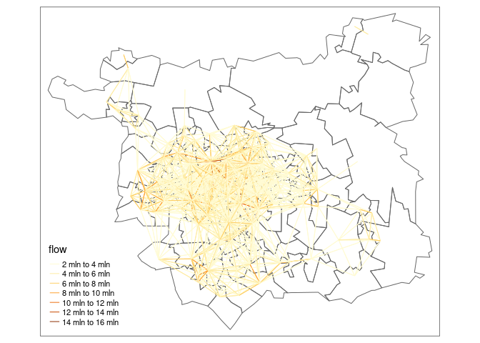
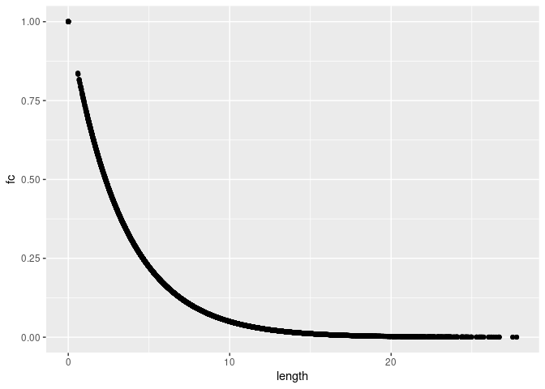
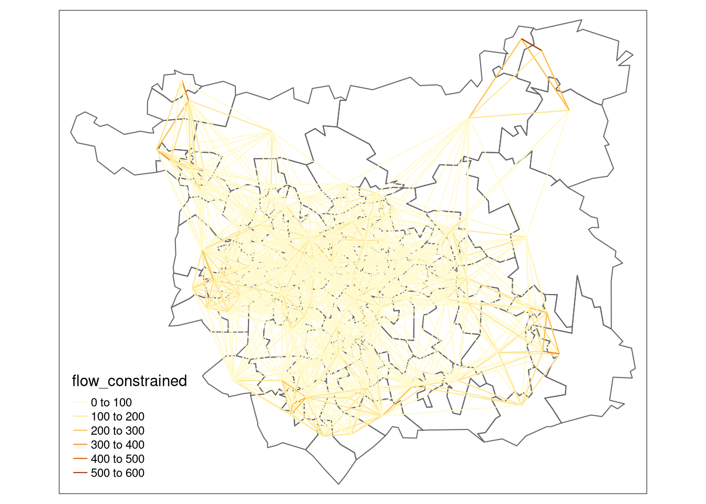
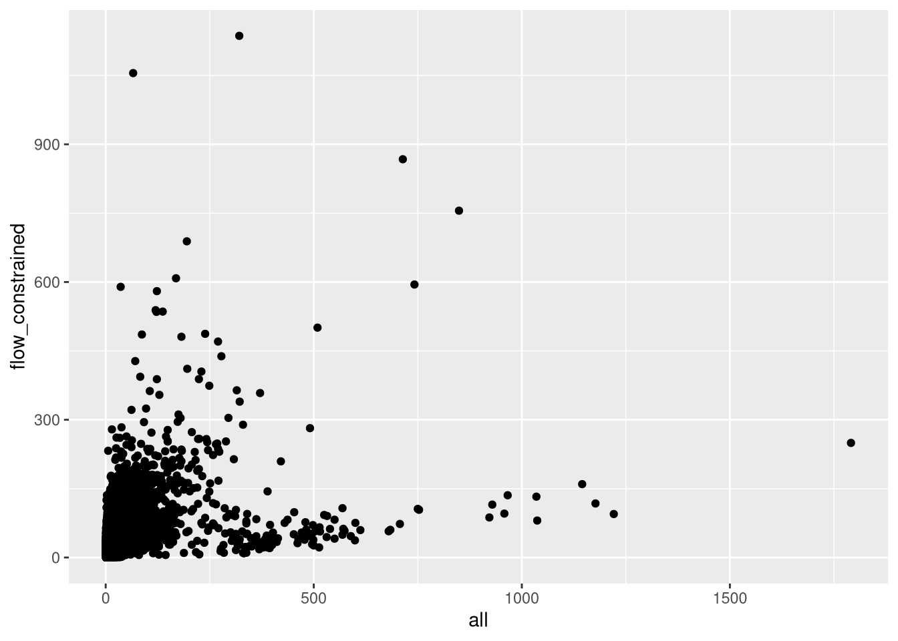

<!-- badges: start -->

[](https://github.com/robinlovelace/si/actions)
<!-- badges: end -->

The goal of this ‘si’ repo is to demonstrate Spatial Interaction models
from first principles. At present it just contains prose and
reproducible code demonstrating how they work. In future it may be
turned into software, e.g. an R package, for others wanting to develop
spatial interaction models.

# <span class="header-section-number">1</span> What are SIMs?

Spatial Interaction Models (SIMs) are mathematical models for estimating
movement between spatial entities developed by Alan Wilson in the late
1960s and early 1970, with considerable uptake and refinement for
transport modelling since then Boyce and Williams (2015). There are four
main types of traditional SIMs (Wilson 1971):

-   Unconstrained

-   Production-constrained

-   Attraction-constrained

-   Doubly-constrained

Traditional ‘gravity model’ based SIMs can be defined as follows, based
on the original definition (Wilson 1971):

} W_{j}^{(2)}}{c_{i j}^{n}}")

“where

is a measure of the interaction between zones
 and
}")
is a measure of the ‘mass term’ associated with zone
,
}")
is a measure of the ‘mass term’ associated with zone
, and
 is
a measure of the distance, or generalised cost of travel, between zone
 and zone
”.
 is a ‘constant of
proportionality’ and  is
a parameter to be estimated.

Redefining the  terms as
 and
 for origins and
destinations respectively (Simini et al. 2012), this classic definition
of the ‘gravity model’ can be written as follows:


For the purposes of this project, we will focus on
production-constrained SIMs. These can be defined as follows (Wilson
1971):

")

where  is a balancing
factor defined as:

}")

 is analogous to
the travel demand in zone
, which can be roughly
approximated by its population.

<!-- $$ -->
<!-- T_{ij} = \frac{m_{i}^{\alpha} n_{j} ^{\beta}} {f(r_{ij})} -->
<!-- $$ -->
<!-- ## Radiation models -->
<!-- A more recent type of SIM is the radiation model @simini_universal_2012: -->
<!-- $$ -->
<!-- \langle T_{ij} \rangle = T_i \frac{m_{i} n_{j}} {(m_i + s_{ij})(m_i + n_j + s_{ij}) } -->
<!-- $$ -->
<!-- where $s_{ij}$ is defined as the total population living within a circle, the centre of which lies in the centroid of zone $i$ and the radius of which is the distance between zones $i$ and $j$. Thus, the greater the population living within the commute distance, the lower the estimated flow rate. -->

# <span class="header-section-number">2</span> Implementation in R

``` r
library(tmap)
library(pct)
library(tidyverse)
```

``` r
zones = get_pct_zones(region = "west-yorkshire", geography = "msoa")
centroids = get_pct_centroids(region = "west-yorkshire", geography = "msoa")
zones = zones %>% 
  filter(lad_name == "Leeds")
centroids = centroids %>% 
  filter(lad_name == "Leeds")
tm_shape(zones) + tm_polygons("all", palette = "viridis")
```


``` r
od_df = od::points_to_od(centroids)
od_sfc = od::odc_to_sfc(od_df[3:6])
sf::st_crs(od_sfc) = 4326
od_df$length = sf::st_length(od_sfc)
od_df = od_df %>% transmute(
  O, D, length = as.numeric(length) / 1000,
  flow = NA, fc = NA
  )
od_df = sf::st_sf(od_df, geometry = od_sfc, crs = 4326)
```

An unconstrained spatial interaction model can be written as follows,
with a more-or-less arbitrary value for `beta` which can be optimised
later:

``` r
beta = 0.3
i = 1
j = 2
for(i in seq(nrow(zones))) {
  for(j in seq(nrow(zones))) {
    O = zones$all[i]
    n = zones$all[j]
    ij = which(od_df$O == zones$geo_code[i] & od_df$D == zones$geo_code[j])
    od_df$fc[ij] = exp(-beta * od_df$length[ij])
    od_df$flow[ij] = O * n * od_df$fc[ij]
  }
}
od_top = od_df %>% 
  filter(O != D) %>% 
  top_n(n = 2000, wt = flow)

tm_shape(zones) +
  tm_borders() +
  tm_shape(od_top) +
  tm_lines("flow")
```



We can plot the ‘distance decay’ curve associated with this SIM is as
follows:

``` r
summary(od_df$fc)
```

         Min.   1st Qu.    Median      Mean   3rd Qu.      Max. 
    0.0002404 0.0256166 0.0801970 0.1495649 0.2035826 1.0000000 

``` r
od_df %>% 
  ggplot() +
  geom_point(aes(length, fc))
```



We can make this production constrained as follows:

``` r
od_dfj = left_join(
  od_df,
  zones %>% select(O = geo_code, all) %>% sf::st_drop_geometry()
)
```

    Joining, by = "O"

``` r
od_dfj = od_dfj %>% 
  group_by(O) %>% 
  mutate(flow_constrained = flow / sum(flow) * first(all)) %>%
  ungroup()
sum(od_dfj$flow_constrained) == sum(zones$all)
```

    [1] TRUE

``` r
od_top = od_dfj %>% 
  filter(O != D) %>% 
  top_n(n = 2000, wt = flow_constrained)

tm_shape(zones) +
  tm_borders() +
  tm_shape(od_top) +
  tm_lines("flow_constrained")
```



# <span class="header-section-number">3</span> Validation

``` r
od_census = get_od()
```

    No region provided. Returning national OD data.

    Rows: 2402201 Columns: 14
    ── Column specification ────────────────────────────────────────────────────────
    Delimiter: ","
    chr  (2): Area of residence, Area of workplace
    dbl (12): All categories: Method of travel to work, Work mainly at or from h...

    ℹ Use `spec()` to retrieve the full column specification for this data.
    ℹ Specify the column types or set `show_col_types = FALSE` to quiet this message.
    Rows: 7201 Columns: 6
    ── Column specification ────────────────────────────────────────────────────────
    Delimiter: ","
    chr (2): MSOA11CD, MSOA11NM
    dbl (4): BNGEAST, BNGNORTH, LONGITUDE, LATITUDE

    ℹ Use `spec()` to retrieve the full column specification for this data.
    ℹ Specify the column types or set `show_col_types = FALSE` to quiet this message.

``` r
od_census_min = od_census %>% 
  rename(O = geo_code1, D = geo_code2) %>% 
  filter(O %in% zones$geo_code & D %in% zones$geo_code)
od_dfjc = inner_join(od_dfj %>% select(-all), od_census_min)
```

    Joining, by = c("O", "D")

``` r
od_dfjc %>% 
  ggplot() +
  geom_point(aes(all, flow_constrained))
```



``` r
cor(od_dfjc$all, od_dfjc$flow_constrained)^2
```

    [1] 0.1735933

# <span class="header-section-number">4</span> Implementation in Python

TBC.

# <span class="header-section-number">5</span> Resources

-   Reproducible code implementing SIMs in R (based on the outdated `sp`
    class system): https://rpubs.com/adam_dennett/257231

-   

<div id="refs" class="references csl-bib-body hanging-indent">

<div id="ref-boyce_forecasting_2015" class="csl-entry">

Boyce, David E., and Huw C. W. L. Williams. 2015. *Forecasting Urban
Travel: Past, Present and Future*. Edward Elgar Publishing.

</div>

<div id="ref-simini_universal_2012" class="csl-entry">

Simini, Filippo, Marta C González, Amos Maritan, and Albert-László
Barabási. 2012. “A Universal Model for Mobility and Migration Patterns.”
*Nature*, February, 812. <https://doi.org/10.1038/nature10856>.

</div>

<div id="ref-wilson_family_1971" class="csl-entry">

Wilson, AG. 1971. “A Family of Spatial Interaction Models, and
Associated Developments.” *Environment and Planning* 3 (January): 132.
<http://www.environment-and-planning.com/epa/fulltext/a03/a030001.pdf>.

</div>

</div>
